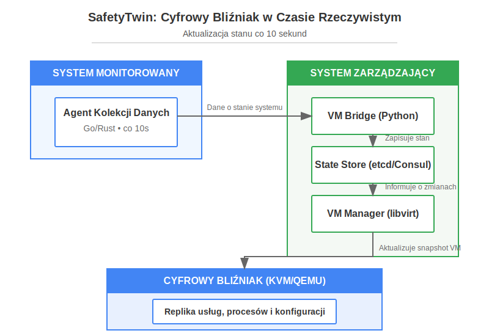

# [safetytwin](safetytwin.com) - System Cyfrowego Bliźniaka w Czasie Rzeczywistym

---

## 📚 Menu nawigacyjne

- [README (Start)](README.md)
- [Instrukcja instalacji](INSTALL.md)
- [Szczegółowa instalacja](docs/installation.md)
- [Stan instalatora](INSTALL_STATE.md)
- [Wynik instalacji](INSTALL_RESULT.yaml)
- [FAQ](docs/faq.md)
- [Rozwiązywanie problemów](docs/troubleshooting.md)
- [Przegląd architektury](docs/overview.md)
- [Agent](docs/agent.md)
- [VM Bridge](docs/vm-bridge.md)
- [Ansible](docs/ansible.md)
- [API](docs/api.md)
- [Strategia](STRATEGIA.md)

---



Projekt umożliwia tworzenie i aktualizację cyfrowego bliźniaka komputera w czasie rzeczywistym, z częstotliwością co 10 sekund. System koncentruje się na usługach działających w tle i umożliwia natychmiastowe odtworzenie stanu systemu w wirtualnym środowisku.

---

## 🛠️ SafetyTwin Provisioning & Diagnostics Workflow

**Key Scripts:**
- `install.sh` – Main installer, sets up the host, VM, and all services.
- `preinstall.sh` – Minimal VM/cloud-init provisioning and troubleshooting tool.
- `diagnostics.sh` – Runs inside the VM to check system configuration, health, and compliance.
- `diagnostics_download.sh` – Orchestrates copying and running diagnostics.sh on the VM and downloads the resulting log to the host.

### Step-by-step Workflow
1. **Provision the VM:**
   - Use `preinstall.sh` for minimal troubleshooting/validation, or `install.sh` for full provisioning.
2. **Run Diagnostics:**
   - From the host, execute `diagnostics_download.sh`. This will:
     - Start the VM if needed
     - Copy `diagnostics.sh` to the VM
     - Execute diagnostics inside the VM
     - Download the diagnostics log to your local machine automatically
3. **Review Results:**
   - The diagnostics log is saved in a timestamped `vm_logs_YYYYMMDD_HHMMSS` directory.
   - To view summary/errors/warnings:
     ```bash
     grep -E '\[ERROR\]|\[WARNING\]|\[OK\]' ./vm_logs_YYYYMMDD_HHMMSS/diagnostics_*.log
     ```
   - For full details, open the log file in your editor.

### Where to Find More Details
- [INSTALL.md](INSTALL.md) – Full installation and troubleshooting guide
- [diagnostics.md](diagnostics.md) – Detailed diagnostics script documentation
- [preinstall.md](preinstall.md) – VM provisioning and troubleshooting

---


**Nowość (2025-05):**
- Skrypt `repair.sh` automatycznie diagnozuje i naprawia sieć VM po instalacji, zbiera szczegółowe logi diagnostyczne do pliku `/var/lib/safetytwin/TWIN.yaml` oraz automatycznie zamyka aktywne sesje konsoli VM, aby umożliwić zbieranie danych.
- W przypadku braku możliwości zebrania diagnostyki, skrypt generuje jasne instrukcje ręczne dla użytkownika.

---

## WAŻNE: Tworzenie VM i cloud-init

Aby cloud-init działał poprawnie i użytkownik `ubuntu` został utworzony z hasłem:

- **Cloud-init ISO MUSI być podpięte jako CD-ROM na szynie IDE (bus=ide, device=cdrom, np. /dev/hdc lub /dev/cdrom)**. W przeciwnym razie cloud-init NIE przetworzy user-data i nie utworzy użytkownika ani nie ustawi hasła.
- Przykład poprawnej komendy:
  ```bash
  sudo virt-install --name safetytwin-vm \
    --memory 2048 \
    --vcpus 2 \
    --disk /var/lib/safetytwin/images/ubuntu-base.img,device=disk,bus=virtio \
    --disk /var/lib/safetytwin/cloud-init/cloud-init.iso,device=cdrom,bus=ide \
    --os-variant ubuntu20.04 \
    --virt-type kvm \
    --graphics none \
    --network network=default,model=virtio \
    --import \
    --noautoconsole \
    --check path_in_use=off
  ```
- **Zawsze niszcz i usuwaj VM przed ponowną instalacją**:
  ```bash
  sudo virsh destroy safetytwin-vm || true
  sudo virsh undefine --nvram safetytwin-vm || true
  ```
- Jeśli nie możesz się zalogować na `ubuntu`/`safetytwin` i użytkownik nie istnieje w VM – oznacza to, że cloud-init nie przetworzył user-data (najczęściej z powodu złego podpięcia ISO).
- Sprawdź obecność `/dev/cdrom` lub `/dev/hdc` w VM oraz logi cloud-init (`/var/log/cloud-init.log`).
- Szczegóły i przykłady znajdziesz w `restart.sh` oraz `install.sh`.


```
┌─────────────────────────┐     ┌─────────────────────────┐
│  System monitorowany    │     │   System zarządzający   │
│  (Host fizyczny)        │     │   (Kontroler)           │
│                         │     │                         │
│  ┌───────────────────┐  │     │  ┌───────────────────┐  │
│  │ Agent kolekcji    │──┼─────┼─▶│ Orchestrator      │  │
│  │ danych            │  │     │  │                   │  │
│  └───────────────────┘  │     │  └───────────────────┘  │
│                         │     │           │             │
└─────────────────────────┘     │           ▼             │
                                │  ┌───────────────────┐  │
                                │  │ State Store       │  │
                                │  │ (etcd/Consul)     │  │
                                │  └───────────────────┘  │
                                │           │             │
                                │           ▼             │
                                │  ┌───────────────────┐  │
                                │  │ VM Manager        │  │
                                │  │ (libvirt)         │  │
                                │  └───────────────────┘  │
                                │           │             │
                                └───────────┼─────────────┘
                                            │
                                            ▼
                               ┌──────────────────────────────┐
                               │     Cyfrowy Bliźniak (VM)    │
                               │                              │
                               │  ┌──────────────────────┐    │
                               │  │ Usługi               │    │
                               │  └──────────────────────┘    │
                               └──────────────────────────────┘
```

## Główne komponenty

### 1. Agent zbierania danych

Agent pracujący na monitorowanym systemie, który co 10 sekund zbiera:
- Stan usług systemowych (systemd, Docker, inne)
- Informacje o procesach
- Obciążenie systemu (CPU, pamięć, I/O)
- Konfiguracje i zależności usług

**Technologie**: Go lub Rust dla wydajności, minimalne zużycie zasobów

### 2. Orchestrator centralny

Zarządza całym procesem tworzenia i aktualizacji cyfrowego bliźniaka:
- Przetwarza dane z agenta
- Generuje deklaratywne opisy infrastruktury
- Zarządza snapshotami VM
- Koordynuje proces aktualizacji

**Technologie**: Python/Go, REST API

### 3. State Store

Przechowuje aktualny i historyczny stan systemu:
- Informacje o usługach i ich konfiguracji
- Zależności między usługami
- Szablony i parametry konfiguracyjne

**Technologie**: etcd lub Consul

### 4. VM Manager

Zarządza wirtualną maszyną cyfrowego bliźniaka:
- Tworzy VM bazową na podstawie obrazu systemu
- Zarządza snapshotami (tworzenie, przełączanie)
- Stosuje konfiguracje przy użyciu Ansible

**Technologie**: libvirt, QEMU/KVM

### 5. Terraform Provider

Specjalny provider do Terraform, umożliwiający deklaratywny opis stanu usług:
- Definicje usług systemowych
- Konfiguracja procesów
- Zarządzanie zależnościami

**Technologie**: Go (Terraform Provider SDK)

## Proces aktualizacji co 10 sekund

1. Agent zbiera dane o aktualnym stanie systemu
2. Dane są przesyłane do Orchestratora
3. Orchestrator porównuje stan z poprzednim i identyfikuje zmiany
4. Jeśli wykryto zmiany:
   - Generuje nową konfigurację Terraform/Ansible
   - Tworzy nowy snapshot VM lub aktualizuje istniejący
   - Stosuje zmiany konfiguracji do VM

Proces ten jest zoptymalizowany pod kątem szybkości - aktualizacje dotyczą tylko elementów, które się zmieniły, bez potrzeby pełnej rekonstrukcji bliźniaka.

## Zalety w porównaniu do podejścia opartego wyłącznie na Dockerze

1. **Wierniejsze odwzorowanie** - pełna VM lepiej symuluje rzeczywisty system niż kontenery
2. **Szybsze aktualizacje** - snapshoty VM są znacznie szybsze niż przebudowa kontenerów
3. **Precyzyjne zarządzanie stanem** - etcd/Consul zapewnia dokładne śledzenie zmian
4. **Wsparcie dla większej liczby usług** - niektóre usługi systemowe trudno uruchomić w Dockerze
5. **Lepsza izolacja** - pełna wirtualizacja zapewnia lepszą izolację niż kontenery

## Implementacja - kluczowe elementy

### Agent zbierania danych (przykładowy kod Go)

```go
package main

import (
    "time"
    "encoding/json"
    "github.com/shirou/gopsutil/process"
    "github.com/shirou/gopsutil/host"
    "github.com/shirou/gopsutil/cpu"
    "github.com/shirou/gopsutil/mem"
)

func collectSystemState() (map[string]interface{}) {
    state := make(map[string]interface{})
    
    // Zbierz informacje o procesach
    processes, _ := process.Processes()
    processInfo := []map[string]interface{}{}
    
    for _, p := range processes {
        name, _ := p.Name()
        cmdline, _ := p.Cmdline()
        cpu, _ := p.CPUPercent()
        
        processInfo = append(processInfo, map[string]interface{}{
            "pid": p.Pid,
            "name": name,
            "cmdline": cmdline,
            "cpu_percent": cpu,
        })
    }
    
    state["processes"] = processInfo
    
    // Zbierz informacje o usługach systemd
    // Kod zbierania informacji o usługach...
    
    // Zbierz informacje o sprzęcie
    cpuInfo, _ := cpu.Info()
    memInfo, _ := mem.VirtualMemory()
    hostInfo, _ := host.Info()
    
    state["hardware"] = map[string]interface{}{
        "cpu": cpuInfo,
        "memory": memInfo,
        "host": hostInfo,
    }
    
    return state
}

func main() {
    ticker := time.NewTicker(10 * time.Second)
    defer ticker.Stop()
    
    for {
        select {
        case <-ticker.C:
            state := collectSystemState()
            
            // Wyślij dane do orchestratora
            stateJson, _ := json.Marshal(state)
            sendToOrchestrator(stateJson)
        }
    }
}
```

### Zarządzanie snapshotami VM (przykładowy kod Python)

```python
import libvirt
import time
import xml.etree.ElementTree as ET

class VMManager:
    def __init__(self, uri='qemu:///system'):
        self.conn = libvirt.open(uri)
        if self.conn is None:
            raise Exception("Failed to connect to hypervisor")
        
    def create_snapshot(self, domain_name, snapshot_name):
        """Tworzy snapshot VM"""
        dom = self.conn.lookupByName(domain_name)
        if dom is None:
            raise Exception(f"Failed to find domain {domain_name}")
            
        # Przygotuj XML dla snapshota
        snapshot_xml = f"""
        <domainsnapshot>
            <name>{snapshot_name}</name>
            <description>Snapshot at {time.strftime('%Y-%m-%d %H:%M:%S')}</description>
        </domainsnapshot>
        """
        
        # Utwórz snapshot
        snapshot = dom.snapshotCreateXML(snapshot_xml)
        return snapshot.getName()
        
    def revert_to_snapshot(self, domain_name, snapshot_name):
        """Przywraca VM do wskazanego snapshota"""
        dom = self.conn.lookupByName(domain_name)
        if dom is None:
            raise Exception(f"Failed to find domain {domain_name}")
            
        # Znajdź snapshot
        snapshot = dom.snapshotLookupByName(snapshot_name)
        if snapshot is None:
            raise Exception(f"Failed to find snapshot {snapshot_name}")
            
        # Przywróć do snapshota
        return dom.revertToSnapshot(snapshot)
        
    def apply_service_config(self, domain_name, service_config):
        """Stosuje konfigurację usług do VM poprzez Ansible"""
        # Zapisz konfigurację do pliku
        with open('service_config.yaml', 'w') as f:
            yaml.dump(service_config, f)
            
        # Uruchom Ansible
        ansible_cmd = f"ansible-playbook -i {domain_name}, apply_services.yml"
        subprocess.run(ansible_cmd, shell=True, check=True)
```

### Orchestrator centralny (przykładowy kod Python)

```python
import time
import json
import hashlib
from deepdiff import DeepDiff
from flask import Flask, request, jsonify

app = Flask(__name__)
current_state = {}
vm_manager = VMManager()
state_store = StateStore()  # etcd/Consul client

@app.route('/api/v1/update_state', methods=['POST'])
def update_state():
    """Endpoint do aktualizacji stanu systemu"""
    new_state = request.json
    
    # Oblicz hash stanu dla szybkiego porównania
    new_state_hash = hashlib.md5(json.dumps(new_state, sort_keys=True).encode()).hexdigest()
    current_state_hash = hashlib.md5(json.dumps(current_state, sort_keys=True).encode()).hexdigest()
    
    # Jeśli stan się zmienił
    if new_state_hash != current_state_hash:
        # Znajdź różnice
        diff = DeepDiff(current_state, new_state)
        
        # Zaktualizuj stan w state store
        state_store.update_state(new_state)
        
        # Generuj konfigurację dla VM
        service_config = generate_service_config(new_state)
        
        # Utwórz snapshot i zastosuj konfigurację
        snapshot_name = f"state_{int(time.time())}"
        vm_manager.create_snapshot("digital_twin", snapshot_name)
        vm_manager.apply_service_config("digital_twin", service_config)
        
        # Aktualizuj bieżący stan
        current_state = new_state
        
        return jsonify({"status": "updated", "changes": diff})
    else:
        return jsonify({"status": "no_changes"})

def generate_service_config(state):
    """Generuje konfigurację usług na podstawie stanu systemu"""
    services = {}
    
    # Przetwórz usługi systemd
    for process in state.get("processes", []):
        if process.get("name") in ["systemd", "init"]:
            # Logika identyfikacji usług systemd
            pass
    
    # Przetwórz usługi Docker
    # Kod przetwarzania kontenerów Docker...
    
    return services

if __name__ == '__main__':
    app.run(host='0.0.0.0', port=5000)
```

## Wdrożenie systemu

1. **Konfiguracja początkowa**:
   - Utworzenie bazowego obrazu VM zgodnego z monitorowanym systemem
   - Instalacja agenta na monitorowanym systemie
   - Konfiguracja VM Manager i Orchestratora

2. **Pierwsze uruchomienie**:
   - Pełne skanowanie systemu przez agenta
   - Utworzenie kompletnego modelu systemu
   - Wdrożenie bazowego cyfrowego bliźniaka

3. **Cykl pracy**:
   - Co 10 sekund agent zbiera dane o zmianach
   - Orchestrator aktualizuje model i stosuje zmiany
   - Tworzony jest nowy snapshot VM

## Optymalizacje dla minimalnego opóźnienia

1. **Hierarchia snapshotów** - snapshoty tylko dla istotnych zmian
2. **Inkrementalne aktualizacje** - stosowanie tylko zmian, bez przeładowywania usług, które się nie zmieniły
3. **Buforowanie konfiguracji** - przechowywanie wstępnie przetworzonych konfiguracji
4. **Równoległe przetwarzanie** - jednoczesne stosowanie zmian dla niezależnych usług
5. **Predykcja zmian** - analizowanie wzorców zmian do wyprzedzającego przygotowania konfiguracji

## Narzędzia i biblioteki

- **libvirt/QEMU/KVM** - zarządzanie wirtualizacją
- **etcd/Consul** - przechowywanie stanu
- **Terraform** - deklaratywna definicja infrastruktury
- **Ansible** - konfiguracja VM
- **systemd-analyze** - analiza usług systemd
- **Docker API** - monitorowanie kontenerów Docker
- **eBPF/bpftrace** - głębokie monitorowanie na poziomie kernela

To rozwiązanie zapewnia kompleksowy, szybki i dokładny cyfrowy bliźniak komputera, aktualizowany co 10 sekund i gotowy do natychmiastowego użycia.


# System Cyfrowego Bliźniaka w Czasie Rzeczywistym

## Przegląd Rozwiązania

Stworzyliśmy kompletny system do tworzenia i aktualizacji cyfrowego bliźniaka infrastruktury komputerowej w czasie rzeczywistym (co 10 sekund). System koncentruje się na usługach działających w tle i umożliwia natychmiastowe odtworzenie stanu systemu w wirtualnym środowisku.

### Główne Cechy

- **Aktualizacja co 10 sekund** - zbieranie danych i aktualizacja cyfrowego bliźniaka z wysoką częstotliwością
- **Śledzenie usług i procesów** - monitorowanie wszystkich usług systemowych i procesów
- **Snapshoty VM** - szybkie przełączanie między stanami systemu
- **Wykorzystanie libvirt/KVM** - pełna wirtualizacja dla lepszego odwzorowania rzeczywistego systemu
- **Lekki agent** - minimalne obciążenie monitorowanego systemu
- **Deklaratywne podejście** - automatyczne generowanie konfiguracji w oparciu o bieżący stan systemu

## Komponenty Systemu

### 1. Agent Zbierania Danych (Go)

Agent pracujący na monitorowanym systemie, napisany w Go dla osiągnięcia maksymalnej wydajności. Główne funkcje:

- Zbieranie informacji o sprzęcie (CPU, pamięć, dyski, sieć)
- Zbieranie informacji o usługach systemowych (systemd)
- Zbieranie informacji o kontenerach Docker
- Zbieranie informacji o procesach, ze szczególnym uwzględnieniem procesów LLM
- Przesyłanie danych do VM Bridge co 10 sekund

### 2. VM Bridge (Python)

Most między systemem monitorowanym a wirtualną maszyną, zarządzający procesem tworzenia i aktualizacji cyfrowego bliźniaka:

- Odbieranie danych z agenta
- Tworzenie i zarządzanie snapshotami VM
- Generowanie konfiguracji usług
- Stosowanie zmian do VM przy użyciu Ansible
- Wykrywanie zmian i minimalizacja operacji aktualizacji

### 3. Maszyna Wirtualna (Libvirt/KVM)

Faktyczny cyfrowy bliźniak, uruchomiony jako maszyna wirtualna:

- Bazowy obraz Ubuntu 20.04
- Skonfigurowany przy użyciu cloud-init
- Zainstalowane narzędzia do replikacji usług (Docker, systemd)
- Zarządzany przez VM Bridge za pomocą Ansible

### 4. Ansible Playbook

Playbook do konfiguracji usług w maszynie wirtualnej:

- Konfiguracja systemd
- Konfiguracja kontenerów Docker
- Konfiguracja niezależnych procesów
- Pełna replikacja stanu usług z systemu monitorowanego

### 5. Skrypt Instalacyjny

Prosty w użyciu skrypt instalacyjny całego systemu:

- Sprawdzanie wymagań systemowych
- Konfiguracja wszystkich komponentów
- Tworzenie bazowej maszyny wirtualnej
- Instalacja VM Bridge na VM
- Uruchamianie usług
- Szczegółowe podsumowanie instalacji

## Przepływ Danych

1. **Agent** zbiera dane o sprzęcie, usługach i procesach co 10 sekund
2. **VM Bridge** odbiera dane i porównuje je z aktualnym stanem
3. Przy wykryciu zmian, **VM Bridge** tworzy nowy snapshot VM
4. **VM Bridge** generuje konfigurację usług i stosuje ją poprzez **Ansible**
5. **Maszyna Wirtualna** aktualizuje swój stan, aby odzwierciedlać system monitorowany

## Przypadki Użycia

1. **Testowanie i Debugowanie** - możliwość testowania zmian konfiguracji bez wpływu na produkcyjny system
2. **Analiza Awarii** - odtworzenie stanu systemu przed awarią
3. **Bezpieczeństwo** - analiza potencjalnie złośliwego oprogramowania w izolowanym środowisku
4. **Migracja** - przygotowanie do migracji systemu z fizycznego do wirtualnego
5. **Szkolenia** - bezpieczne środowisko do nauki administracji systemem

## Zalety w Porównaniu do Innych Rozwiązań

1. **Wyższa dokładność** - pełna wirtualizacja zamiast konteneryzacji
2. **Szybsza aktualizacja** - wykorzystanie snapshotów VM zamiast pełnej rekonstrukcji
3. **Lepsza izolacja** - kompletne oddzielenie cyfrowego bliźniaka od systemu produkcyjnego
4. **Szersze wsparcie** - możliwość replikacji praktycznie każdej usługi systemowej
5. **Historia zmian** - przechowywanie historycznych stanów systemu

## Wymagania Systemowe

- **System operacyjny**: Linux (Ubuntu 20.04+ lub podobny)
- **Procesor**: CPU z obsługą wirtualizacji (VT-x/AMD-V)
- **Pamięć**: minimum 8GB RAM (4GB dla VM + 4GB dla systemu)
- **Dysk**: minimum 50GB wolnego miejsca
- **Sieć**: połączenie sieciowe między systemem monitorowanym a VM

## Jak Zacząć

1. Uruchom skrypt instalacyjny jako root:
   ```bash
   sudo bash install.sh
   ```

2. Po instalacji VM będzie regularnie aktualizowana automatycznie.

3. Możesz monitorować logi za pomocą:
   ```bash
   journalctl -fu digital-twin-agent
   ```

4. Aby uzyskać dostęp do VM:
   ```bash
   ssh -i /etc/digital-twin/ssh/id_rsa root@[VM_IP]
   ```

## Możliwości Rozszerzenia

1. **Dashboard** - interfejs webowy do monitorowania stanu cyfrowego bliźniaka
2. **API** - rozszerzony interfejs programistyczny do interakcji z systemem
3. **Klonowanie wielokrotne** - tworzenie wielu instancji cyfrowego bliźniaka
4. **Analiza porównawcza** - narzędzia do porównywania różnych stanów systemu
5. **Eksport konfiguracji** - generowanie plików konfiguracyjnych w różnych formatach (Terraform, Puppet, Chef)

---

Ten system stanowi kompleksowe rozwiązanie do tworzenia "żywego" cyfrowego bliźniaka infrastruktury komputerowej, który jest aktualizowany w czasie rzeczywistym i może być wykorzystany do wielu zastosowań w obszarze DevOps, bezpieczeństwa i administracji systemami.